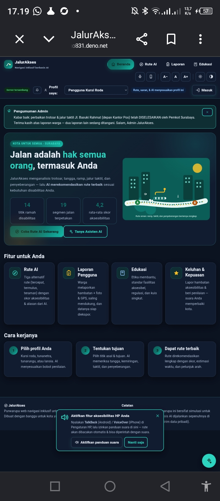
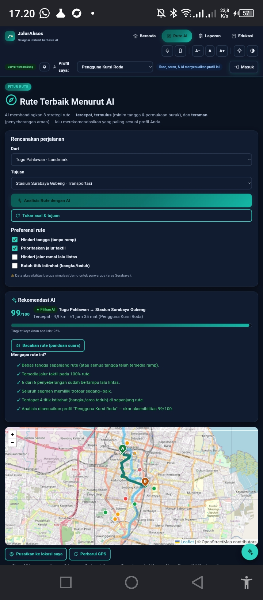
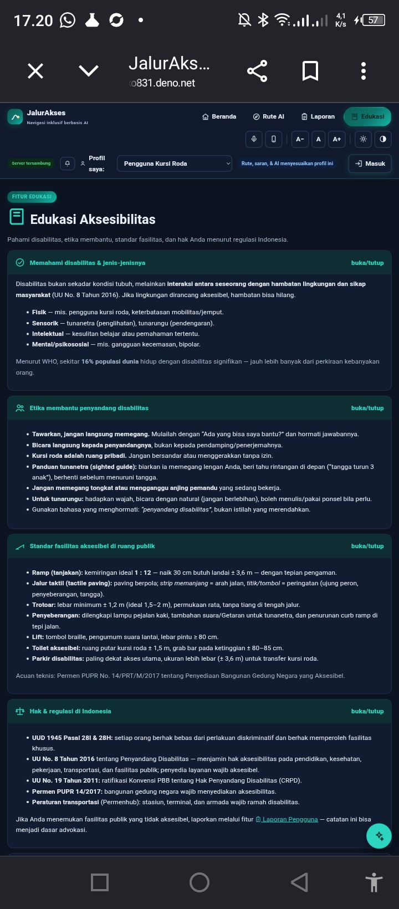

<div align="center">

  # JalurAkses

  ### Navigasi Ramah Disabilitas Berbasis AI — Rute Aksesibel, Suara, dan Laporan Warga yang Sampai ke Admin

  [](https://jalurakses.tixo831.deno.net)

  [](https://github.com/tixo831/jalurakses)

  [](LICENSE)

  **Submission for ITECHNO CUP 2026 - Web Development**

  **By Muhammad Azraf Hamiz Kurnianto · Mustiko Muhammad Santoso · Aryasatya Rezandria Azmi**

</div>

---

## 📋 Daftar Isi

- [Tentang Proyek](#-tentang-proyek)
- [Fitur Unggulan](#-fitur-unggulan)
- [Demo & Screenshot](#-demo--screenshot)
- [Teknologi](#-teknologi)
- [Arsitektur Sistem](#-arsitektur-sistem)
- [Instalasi & Setup](#-instalasi--setup)
- [Penggunaan](#-penggunaan)
- [API Documentation](#-api-documentation)
- [Testing](#-testing)
- [Tim Developer](#-tim-pengembang)
- [Lisensi](#-lisensi)

---

## 👥 Tim Pengembang

| Nama | Peran | GitHub |
|------|-------|--------|
| **Muhammad Azraf Hamiz Kurnianto** | Project & UI/UX Designer | - |
| **Mustiko Muhammad Santoso** | Full Stack Developer | [tixo831](https://github.com/tixo831) |
| **Aryasatya Rezandria Azmi** | Ide Developer | [azry4f](https://github.com/azry4f) |

---

## 🎯 Tentang Proyek

### Latar Belakang

Berdasarkan proyeksi Badan Pusat Statistik, terdapat ±22 juta penyandang disabilitas di Indonesia, dan Surabaya sebagai kota terpadat kedua di Indonesia menjadi rumah bagi puluhan ribu di antaranya. Nyatanya, berjalan di kota ini masih menjadi tantangan besar: jalur taktil yang putus dan tertutup lapak, trotoar tanpa ramp, lift stasiun yang sering mati, hingga penyeberangan tanpa sinyal audio bagi tunanetra. Aplikasi peta umum (Google Maps, Waze) tidak mempertimbangkan tangga, permukaan jalur, jalur taktil, maupun keamanan penyeberangan — informasi yang justru paling menentukan bagi penyandang disabilitas. Di sisi lain, laporan hambatan aksesibilitas warga sering berhenti sebagai keluhan di media sosial tanpa sampai ke pengelola kota.

### Solusi yang Ditawarkan

**JalurAkses** menggabungkan tiga hal dalam satu platform web (mobile-first):

1. **AI Perencana Rute Aksesibel** — algoritma Dijkstra multi-kriteria buatan sendiri (tercepat / termulus / teraman) yang menilai setiap segmen jalan nyata di Surabaya (trotoar, jalur taktil, tangga+ram, penyeberangan berlampu, kemiringan, titik istirahat) dan memberi skor aksesibilitas 0–100 per profil disabilitas, lengkap dengan penjelasan "mengapa rute ini dipilih".
2. **Aksesibilitas HP yang Terhubung Langsung** — panduan suara (TTS), perintah suara bahasa Indonesia, **mikrofon selalu aktif khusus Tunanetra** (hands-free penuh, jeda cerdas saat suara panduan berbicara), getaran, mode gelap/kontras mengikuti sistem, layar tetap menyala, dan notifikasi perangkat asli.
3. **Laporan Warga → Admin Tanpa Putus** — laporan hambatan dengan foto + titik GPS + link Google Maps **otomatis terkirim langsung ke WhatsApp & email admin** (wa.me terbuka otomatis dengan pesan terformat), tersinkron lintas perangkat lewat backend, dan dikelola admin (verifikasi, status, pengumuman, ekspor CSV/JSON).

### Tujuan Proyek

- 🎯 **Tujuan Utama**: Membantu penyandang disabilitas bergerak mandiri dan aman di Surabaya sekaligus menyalurkan suara mereka secara terukur kepada pengelola kota.
- 📊 **Target Pengguna**: Penyandang disabilitas (tunanetra, tunarungu, pengguna kursi roda, lansia/disabilitas fisik lain), warga umum pelapor, dan admin/petugas kota.
- 💡 **Value Proposition**: Satu-satunya navigasi yang berpikir seperti penyandang disabilitas — profil disabilitas mengubah perhitungan rute, antarmuka, dan cara interaksi (suara/hands-free), bukan sekadar peta biasa dengan label "ramah".

---

## ✨ Fitur Unggulan

### Fitur Utama

| Fitur | Deskripsi | Keunggulan |
|----------|--------------|---------------|
| **Rute AI Multi-Kriteria** | Membandingkan 3 strategi (tercepat/termulus/teraman) pada graf jalan nyata Surabaya (14 POI, segmen beratribut lengkap, sungai hanya bisa diseberangi di jembatan — auto-deteksi) | Skor aksesibilitas 0–100 per profil + penjelasan alasan per rute; GPS real-time dengan re-rute otomatis |
| **Always-On Mic untuk Tunanetra** | Saat profil Tunanetra aktif, mikrofon selalu mendengarkan — cukup bicara ("rute ke Gubeng", "baca rute", "mode gelap") tanpa menyentuh layar | Hands-free penuh + jeda cerdas saat panduan suara berbicara (anti memicu diri sendiri) |
| **Laporan → WhatsApp Admin Otomatis** | Laporan (kategori, lokasi, GPS+link Google Maps, foto, dampak) setelah dikirim langsung membuka WhatsApp admin dengan pesan terformat; tersedia juga Email & share native HP | Barier "laporan tidak sampai" hilang — admin menerima laporan di aplikasi yang sudah dipakai sehari-hari |
| **Panel Admin & Dashboard Server** | Statistik (server + lokal), ubah status (Baru→Diproses→Selesai), verifikasi laporan, hapus, pengumuman ke semua pengguna, kontak tujuan WA/email yang bisa diganti, ekspor CSV 15 kolom/JSON, periksa & unduh database | Role-based (kontrol admin tidak muncul di pengguna), data lintas perangkat real-time |

### Fitur Tambahan

- **Akun & Daftar** — daftar (nama, email/No. HP, sandi ter-hash scrypt, tanggal lahir, jenis pengguna) → profil aplikasi otomatis menyesuaikan jenis disabilitas
- **Poin & Level Kontribusi** — Perintis → Kontributor → Duta Muda → Duta Aksesibilitas (+10/laporan, +5 saat selesai, +2 penilaian)
- **"Laporan Saya"** — timeline status Dikirim→Diproses→Selesai + badge Terverifikasi
- **Notifikasi** — bel in-app + badge belum-dibaca + **notifikasi perangkat asli** (Notification API)
- **Rute Tersimpan** — simpan hasil AI, buka ulang 1 ketukan
- **Asisten AI Chat** — pencari rute, tips per profil, penjelasan taktil/ramp/regulasi (UU 8/2016, UU 19/2011) bahasa Indonesia
- **Edukasi & Kuis** — materi, tempat ramah disabilitas + filter fasilitas + cari terdekat GPS
- **Hybrid Offline-First** — badge "Server tersambung / Mode offline"; seluruh fitur tetap berfungsi tanpa internet
- **Aksesibilitas UI** — kontras tinggi, teks besar, skip-link, ARIA lengkap, 59 ikon SVG (tanpa emoji)

---

## 📸 Demo & Screenshot

### Live Demo

🔗 **[Kunjungi Website](https://jalurakses.tixo831.deno.net)**

Akun demo (sandi `demo1234`): `budi.santoso90@gmail.com` (Tunanetra) · Admin: halaman Masuk → "Masuk sebagai Admin" → sandi `admin2026`. Database live berisi 6 akun, 12 laporan nyata se-Surabaya, rating 4,3/5. Panduan lengkap: [DEMO.md](DEMO.md).

### Screenshot Aplikasi

<div align="center">

  
  <p><em>Beranda — pengumuman admin, badge "Server tersambung", profil disabilitas, statistik kota</em></p>

  
  <p><em>Rute AI — rencanakan perjalanan dengan preferensi, rekomendasi AI + skor aksesibilitas 99/100</em></p>

  
  <p><em>Edukasi — materi disabilitas, etika, standar fasilitas & regulasi (UU No. 8/2016)</em></p>

</div>

### Video Demo

📹 **[Link Video Demo](https://[URL_VIDEO])**
_(opsional)_

---

## 🛠 Teknologi

### Tech Stack

#### Frontend

```
Framework    : Vue 3 (global build CDN — state UI reaktif tanpa build step)
UI           : CSS kustom (glassmorphism, dark mode, kontras tinggi, mobile-first)
Peta         : Leaflet 1.9.4 + tile OpenStreetMap
State Mgmt   : Reactive Vue (view) + objek state vanilla + localStorage (domain)
Ikon         : SVG sprite 59 simbol buatan sendiri (tanpa emoji)
Web API      : SpeechRecognition, SpeechSynthesis, Geolocation, Notification,
               Web Share, Wake Lock, Vibration, matchMedia
```

#### Backend

```
Runtime      : Node.js (v18+) dan Deno 2 (deploy)
Framework    : Express.js 4
Database     : data.json terversi di repo privat GitHub (via GitHub API)
               fallback: Deno KV / file data.json lokal
ORM          : - (storage adapter tipis: load/save, siap diganti PostgreSQL)
Auth         : scrypt + salt (sandi) & bearer token acak 48-hex (30 hari)
```

#### DevOps & Tools

```
Deployment   : Deno Deploy (24/7, global edge) — https://jalurakses.tixo831.deno.net
CI/CD        : Auto-deploy dari GitHub (setiap push ke main)
Testing      : Harness Node.js custom (mock DOM, 60+ asersi) + uji e2e API live
Monitoring   : Logs & metrics console.deno.com
```

### Alasan Pemilihan Teknologi

| Teknologi | Alasan Pemilihan |
|-----------|------------------|
| **Vue 3 (CDN, tanpa build step)** | Reaktivitas framework untuk navigasi/dialog/chat tanpa bundler — aplikasi tetap 1 file HTML yang ringan (±200 KB) dan cepat dimuat di HP kelas bawah pengguna sasaran; mudah diaudit juri |
| **Express.js 4** | Framework backend paling stabil dan ekspresif untuk REST API — routing deklaratif + middleware (JSON body, CORS, `adminOnly`) membuat logika keamanan terpusat dan mudah dibaca |
| **Leaflet + OpenStreetMap** | Open source, ringan, tidak butuh API key — peta interaktif + polyline rute di jalan nyata dengan data jalan hasil ekstraksi Overpass |
| **Deno Deploy + GitHub sebagai database** | Hosting serverless 24/7 gratis; penyimpanan JSON terversi di repo privat memberi persistensi + audit trail (riwayat perubahan data) tanpa biaya database |
| **Dijkstra multi-kriteria buatan sendiri** | Inti "AI" dapat dikustomisasi penuh per profil disabilitas (penalti tangga, bobot taktil/penyeberangan) — transparan dan dapat dijelaskan ke juri |

### Dependencies Utama

```json
{
  "dependencies": {
    "express": "^4.19.2"
  }
}
```

*(Frontend tanpa dependencies npm — Vue & Leaflet via CDN; ikon & algoritma buatan sendiri)*

---

## 🏗 Arsitektur Sistem

### System Architecture

```
┌─────────────────────────────  CLIENT (1 file index.html)  ─────────────────────────────┐
│  Vue 3 (tab, dialog, chat)  │  UI/UX + SVG icons  │  Web API HP (suara, GPS, notif)   │
│  Leaflet maps               │  Dijkstra engine (offline)  │  localStorage (offline-first)│
└───────────────┬──────────────────────────────────────────────┬────────────────────────┘
                │ fetch JSON (bearer token)  same-origin         │ wa.me / mailto / share
                ▼                                                ▼
┌────────────────── SERVER (Deno Deploy, Express 4 — 24/7) ─┐   WhatsApp / Email Admin
│  /api/register /login /admin/login → scrypt + token        │
│  /api/reports (CRUD, up, photos) · /api/announcement       │
│  /api/rating · /api/stats · /api/admin/data (khusus admin) │
│  Middleware: CORS · body 2,5MB · adminOnly · error handler │
└───────────────┬────────────────────────────────────────────┘
                ▼ GitHub API (commit per perubahan)
┌────────────── DATABASE (repo privat: data.json terversi) ─┐
│  users[] (sandi scrypt+salt) · reports[] · ratings[]      │
│  tokens{} · announce — fallback Deno KV / data.json lokal │
└───────────────────────────────────────────────────────────┘
```

### Database Schema

```json
{
  "users":   [{ "uid", "nama", "kontak", "salt", "pass(scrypt)", "tgl", "jenis(netra|rungu|roda|lansia)", "role", "created" }],
  "reports": [{ "id", "uid", "nama", "prof", "kat", "lok", "desc", "bobot", "gps{lat,lng,acc}", "fotos", "photos[]", "status(Baru|Diproses|Selesai)", "verif", "up", "ts" }],
  "ratings": [1..5],
  "tokens":  { "<token>": { "uid", "role", "exp" } },
  "announce": { "ts", "txt" } | null
}
```

### Folder Structure

```
jalurakses/
├── index.html          # Seluruh frontend (Vue 3 + engine rute + UI) — 1 file
├── server.js           # Backend REST (Express) + penyaji frontend + storage adapter
├── package.json        # npm start (Node) — dependencies: express
├── deno.json           # deno task start (Deno Deploy)
├── README.md           # Dokumen ini
├── DEMO.md             # Panduan demo & akun uji
└── LICENSE             # MIT
```

---

## ⚙ Instalasi & Setup

### Prerequisites

Pastikan Anda telah menginstall:

- **Node.js** (v18.x atau lebih tinggi) atau **Deno 2.x**
- **npm**
- **Git**

### Langkah Instalasi

#### 1️⃣ Clone Repository

```bash
git clone https://github.com/tixo831/jalurakses.git
cd jalurakses
```

#### 2️⃣ Install Dependencies

```bash
npm install
```

#### 3️⃣ Setup Environment Variables

Buat file `.env` di root directory (opsional — tanpa ini aplikasi tetap jalan dengan penyimpanan lokal):

```env
# Kata sandi admin (default: admin2026)
ADMIN_PASS="kata-sandi-admin-anda"

# Token GitHub PAT (scope repo) — mengaktifkan database persisten via repo privat
GH_PAT="ghp_xxxxxxxxxxxxxxxxxxxx"

# Port server
PORT=3000
```

#### 4️⃣ Setup Database

Tidak perlu migrasi — penyimpanan otomatis:
- **Online/persisten**: buat repo privat kosong, ganti `GH_API` di `server.js` ke repo Anda, isi `GH_PAT`
- **Lokal**: otomatis memakai file `data.json`

#### 5️⃣ Run Development Server

```bash
npm start          # Node
# atau
deno task start    # Deno
```

Aplikasi akan berjalan di `http://localhost:3000` (frontend + API satu origin)

---

## 🚀 Penggunaan

### Menjalankan Aplikasi

```bash
npm start            # Jalankan server (frontend + backend)
node --check server.js   # Validasi sintaks backend
```

### User Guide

#### Untuk Pengguna Umum

1. **Registrasi/Login**: Tab Masuk → Daftar (nama, email/No. HP, sandi, tanggal lahir, jenis pengguna) — profil aplikasi otomatis menyesuaikan jenis disabilitas Anda. Atau masuk cepat tanpa akun.
2. **Rute AI**: Pilih asal/tujuan (atau "Lokasi saya sekarang" GPS) → *Analisis Rute dengan AI* → bandingkan 3 alternatif + skor + alasan → *Bacakan rute* untuk panduan suara.
3. **Perintah suara**: Profil Tunanetra → mikrofon selalu aktif → cukup ucapkan "rute ke Gubeng", "buka edukasi", "baca rute", "matikan mikrofon".
4. **Lapor hambatan**: Tab Laporan → isi kategori/lokasi/deskripsi + foto (maks. 3) + *Lampirkan titik GPS* → Kirim → **WhatsApp admin terbuka otomatis** dengan laporan terformat + link Google Maps.

#### Untuk Admin

1. **Akses Admin Panel**: Tab Masuk → *"Masuk sebagai Admin"* → sandi `ADMIN_PASS` (default `admin2026`).
2. **Kelola laporan**: Tab Laporan → ubah **Status** (Baru→Diproses→Selesai), **Verifikasi**, atau hapus — berlaku lintas perangkat (tersinkron server); pengguna menerima notifikasi perubahan status.
3. **Pengumuman & data**: Panel Admin → kirim pengumuman (banner di Beranda semua pengguna), set kontak WA/email tujuan, **Periksa database server** (statistik + unduh JSON), ekspor **CSV 15 kolom** untuk Excel.

---

## 📚 API Documentation

### Base URL

```
Development: http://localhost:3000/api
Production:  https://jalurakses.tixo831.deno.net/api
```

### Endpoints

#### Authentication

```http
POST /api/register          # {nama, kontak, pass, tgl, jenis} → {token, user}
POST /api/login             # {kontak, pass} → {token, user}
POST /api/admin/login       # {pass} → {token(admin), user}
GET  /api/me                # Authorization: Bearer <token> → profil
```

#### Reports (Laporan)

```http
GET    /api/reports            # Get all (tanpa foto — ringan)
POST   /api/reports            # Create {uid, nama, kat, lok, desc, bobot, gps, fotos}
POST   /api/reports/:id/up     # Dukungan +1
GET    /api/reports/:id/photos # Foto laporan (base64)
PATCH  /api/reports/:id        # Update status/verif  [ADMIN]
DELETE /api/reports/:id        # Delete              [ADMIN]
```

#### Lainnya

```http
GET /api/announcement   # Pengumuman aktif
PUT /api/announcement   # Set/hapus pengumuman  [ADMIN] {txt}
POST /api/rating        # {v:1..5}
GET /api/stats          # Statistik publik
GET /api/admin/data     # Seluruh isi database  [ADMIN]
```

### Example Request

```javascript
// Login
const response = await fetch('https://jalurakses.tixo831.deno.net/api/login', {
  method: 'POST',
  headers: { 'Content-Type': 'application/json' },
  body: JSON.stringify({
    kontak: 'budi.santoso90@gmail.com',
    pass: 'demo1234'
  })
});
const { token, user } = await response.json();
```

---

## 🧪 Testing

### Running Tests

```bash
# Validasi sintaks backend & engine frontend
node --check server.js

# Harness uji engine (mock DOM — rute, role, akun, kirim WA, sync server)
# 60+ asersi, semuanya PASS
node tests/harness.js
```

### Test Coverage

```
Engine rute        : 728 pasangan rute × 4 profil = 100% reachable ✓
GPS live→POI       : node __live + re-rute otomatis ✓
Role & akun        : admin/pengguna/anonim, scrypt hash, validasi, duplikat, sandi salah ✓
Kirim & sync       : wa.me/email/share, mode online/offline, merge laporan server ✓
Persistensi        : force-redeploy 2× → data utuh (repo privat) ✓
API e2e (live)     : register → login → laporan → aksi admin → stats ✓
```

---

## 📄 Lisensi

Proyek ini dilisensikan di bawah [MIT License](LICENSE) - lihat file LICENSE untuk detail lebih lanjut.

---

<div align="center">

  **Made with ❤️ by Azraf · Mustiko · Arya for ITECHNO CUP 2026**

</div>
